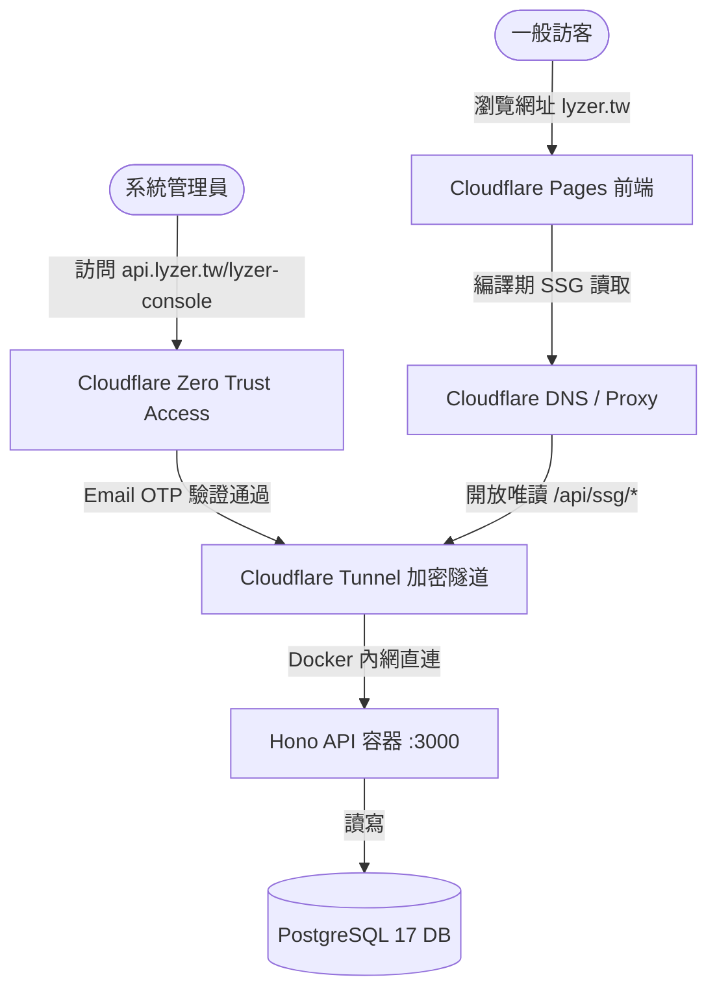

# Cloudflare 部署與安全防護設定紀錄

本文件詳細記錄 LYZER 系統在 Cloudflare 平台上的網域、隧道、安全防護與前端自動編譯部署之完整配置，以便於未來的系統維護與遷移。

> [!WARNING]
> **安全防護提醒**：本文件將上傳至公開 Git 儲存庫，**絕對禁止**在本文中寫入真實的 API Token、Tunnel Token、或是個人密碼。所有敏感金鑰統一使用 `<PLACEHOLDER>` 代替。

---

## 🌐 系統整體架構圖

本系統採用現代化、無外露連接埠的極致安全架構：



---

## 1. 網域與 DNS 託管 (Domain & DNS Setup)

* **網域註冊商**：Dynadot (`lyzer.tw`)
* **託管平台**：Cloudflare DNS
* **設定步驟**：
  1. 在 Cloudflare 新增網域 `lyzer.tw`，取得專屬的名稱伺服器（Nameservers）。
  2. 登入 Dynadot，將 `lyzer.tw` 的名稱伺服器變更為 Cloudflare 指定的名稱伺服器（例如：`jaime.ns.cloudflare.com`、`nia.ns.cloudflare.com`）。
  3. 完成轉移後，所有的 DNS 解析、Proxy 加速、與防護皆由 Cloudflare 接管。

---

## 2. Cloudflare Tunnel 加密隧道 (無開 Port 安全防護)

為了讓位於內網（或 Tailscale）的後端 API 能被 Cloudflare Pages 編譯伺服器讀取，同時避免向世界公開伺服器實體連接埠，我們採用了 **Cloudflare Tunnel (cloudflared)** 方案。

### Docker 容器化配置
我們直接將隧道服務整合進專案根目錄的 [docker-compose.yml](file:///c:/Users/Administrator/Desktop/ly/lyzer/docker-compose.yml) 中：

```yaml
services:
  # ... 其他服務 (postgres, api) ...
  
  tunnel:
    image: cloudflare/cloudflared:latest
    restart: unless-stopped
    command: tunnel --no-autoupdate run
    environment:
      - TUNNEL_TOKEN=${TUNNEL_TOKEN}
    depends_on:
      - api
```

### 伺服器環境變數配置
實體伺服器上的 `.env` 設定：
```env
# 🔒 生產環境機密，切勿提交至 Git
TUNNEL_TOKEN=<YOUR_VERY_LONG_CLOUDFLARE_TUNNEL_TOKEN>
```

### Cloudflare 端路由設定 (Public Hostname)
在 Cloudflare Zero Trust 控制台將子網域直連 Docker 內網：
* **公開主機名稱 (Public Hostname)**：`api.lyzer.tw`
* **路徑 (Path)**：`留空` (匹配所有路徑)
* **服務類型 (Service Type)**：`HTTP`
* **內網 URL**：`http://api:3000` *(藉由 Docker 內部網路，直連名為 api 的容器連接埠，安全度極高)*

---

## 3. Cloudflare Zero Trust Access 安全門防護 (精準權限控管)

為防範他人隨意進入 API 控制台或惡意觸發 Gemini 分析任務，我們在網路最外層建立了兩道安全防線。

### 防線一：保護主控台 UI
* **防護應用程式**：`lyzer-console-ui`
* **保護路徑**：`api.lyzer.tw/lyzer-console`
* **Session 有效期**：`1 week` (一週免重複驗證)

### 防線二：保護敏感維運 API
* **防護應用程式**：`lyzer-jobs-api`
* **保護路徑**：`api.lyzer.tw/jobs/*` *(利用星號萬用字元鎖定底下所有的任務端點)*
* **Session 有效期**：`24 hours`

### 安全原則規則 (Access Policy)
我們對上述兩項應用程式套用了 **`Allow Owner`** 原則：
* **動作 (Action)**：`允許 (Allow)`
* **驗證規則 (Include)**：`電子郵件 (Emails)` 等於 **`ganymede5035@gmail.com`**
* **驗證方式**：Cloudflare 寄送 6 位數一次性密碼（OTP）至指定信箱驗證。

> [!IMPORTANT]
> **核心安全邏輯**：
> * 所有耗費效能與預算的 API（`/jobs/*`）及主控台（`/lyzer-console`）被**完全鎖定**，只有擁有者能使用。
> * 用於前端渲染的唯讀 API（`/api/ssg/*`）保持**完全公開**，以利前端網站編譯與大眾正常瀏覽。

---

## 4. Cloudflare Pages 雲端自動編譯與部署 (SSG Frontend)

網站前端（Astro）完全託管於 Cloudflare Pages 上，享有全球最頂級的 CDN 加速。

### Git 連動與分支偵測
* **專案名稱**：`lyzer`
* **生產分支 (Production branch)**：`v2` *(未來穩定後可更改為 `main`)*
* **架構預設值 (Framework preset)**：`Astro`
* **根目錄 (Root directory)**：`留空` *(自倉庫根目錄啟動)*
* **建置指令 (Build command)**：`pnpm --filter @lyzer/web build`
* **輸出目錄 (Output directory)**：`packages/web/dist`

### 雲端環境變數 (Build Environment Variables)
在 Pages 專案的 `Settings ➔ Environment variables` 中新增：
* **`SSG_API_BASE`** = `https://api.lyzer.tw` *(編譯期用來從後端拉取數據)*

### 5. 雲端手動觸發設定 - Deploy Hook

為了解決「後端資料庫更新，但前端網頁代碼沒變，需要重啟編譯更新內容」的需求，我們配置了雲端勾點：
* **設定位置**：Pages 專案 `Settings ➔ Builds & deployments ➔ Deploy hooks`
* **建立勾點**：`lyzer-db-update` 指向 `v2` 分支。
* **觸發指令 (POST)**：
  ```bash
  # 使用 curl 觸發雲端自動重新編譯
  curl -X POST "https://api.cloudflare.com/client/v4/pages/projects/lyzer/deploy_hooks/<YOUR_DEPLOY_HOOK_TOKEN>"
  ```
